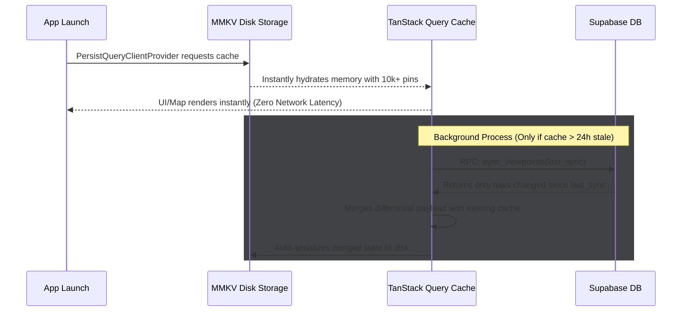

# Phase 2: Core Map Experience & Data Architecture

This document outlines the completions and architectural decisions made during Phase 2 of the Belvedere application.

## 1. UI & Map Integration

### Mapbox Integration
- The map is powered by `@rnmapbox/maps`.
- We replaced the static placeholder with a full-screen map experience `app/(protected)/index.tsx`.
- Map camera logic was implemented using `Camera` component, allowing programmatic flying to specific POIs or search results.
- Custom styled markers (`CustomMapMarker` and `ClusterMarker`) dynamically indicate verified vs. unverified status and adjust sizes.

### UI Overlays
- **FloatingSearch**: Features a capsule-shaped search bar tapping into the Mapbox Geocoding API for global spatial searches (jumping the camera to cities).
- **FilterPills**: A horizontally scrollable row of active filters allowing the user to sort viewpoints by category (Nature, Urban, Historic, etc.) visually filtering markers instantly from the map.

## 2. Local-First Data Architecture (Phase 2.5)

To achieve zero-latency map panning and an instantaneous startup experience, Belvedere utilizes a **Local-First Data Architecture**. Instead of constantly querying the database for points within a specific radius or bounding box as the user moves the map, the application downloads and securely stores the entire dataset of "lite" viewpoint coordinates directly on the user's device. 

This approach completely decouples the map's UI thread from network latency.

### The "Whole World" Clustering Optimization
While typical map implementations only cluster and render points within the visible screen (`visibleBounds`), Belvedere deliberately overrides this convention.

When the map camera is moved (dragged or zoomed), we intentionally *only* update the cluster's `zoom` state. By locking the `useSupercluster` bounding box to the entire globe (`[-180, -85, 180, 85]`), Mapbox and the cluster engine pre-calculate and keep **all** viewpoints in memory globally. We rely on clustering to maintain performance (reducing 10k points to ~50 markers).

**Result**: Zero "pop-in" latency. When the user rapidly pans the camera to a new country or city, the markers are already rendered and waiting for them.

### The Core Stack

1. **Supabase RPC (`sync_viewpoints`)**: A lightning-fast Postgres function that returns only the rows changed since a specific timestamp.
2. **React Native MMKV (v3.3.3)**: A high-performance synchronous key-value store built on native C++ JSI bindings. It serves as our ultra-fast disk storage.
3. **TanStack React Query**: Manages the in-memory cache, background fetching, and UI reactivity.
4. **Mapbox Maps**: Renders the local array of coordinates. `useSupercluster` performs highly-optimized point clustering strictly on the JS thread without expensive re-renders.

### How the Sync Flow Works

1. **Instant Boot (Disk-to-RAM)**:
   When the app launches, TanStack Query's `PersistQueryClientProvider` immediately hydrates its in-memory cache directly from the MMKV disk storage. This takes milliseconds. The map is instantly populated with all known viewpoints before a network request is even attempted.

2. **Differential Synchronization (Background)**:
   The `useViewpointsSync` hook checks the `last_sync_timestamp` value stored in MMKV.
   - It fires off a background request to the Supabase `sync_viewpoints` RPC with this timestamp.
   - **First Launch**: If the timestamp is null, Supabase returns the entire active catalog of viewpoints.
   - **Subsequent Launches**: Supabase returns *only* the new, updated, or recently verified viewpoints since the last launch.

3. **Cache Merge and Persist**:
   The new data payload is merged into the TanStack Query cache. By nature of the `PersistQueryClientProvider`, TanStack Query automatically serializes the new state and writes it back permanently to the MMKV disk layer. The `last_sync_timestamp` memory is updated to the current time.

### Native Configuration Fixes

To ensure perfect compatibility with Expo SDK 54 and avoid the immense build complexities of experimental Nitro Modules, the project relies on **`react-native-mmkv@3.3.3`**. 

This version uses the battle-tested React Native JSI (JavaScript Interface) C++ bridge. 
To satisfy the C++ compilation requirements for `MMKVCore` in Xcode, the project uses `expo-build-properties` within `app.config.ts` to strictly enforce an `ios.deploymentTarget` of `15.1`.

## 3. Future Proofing

As the database grows to hundreds of thousands of POIs, the "Lite Viewpoint" model ensures memory remains efficient. The initial full-sync payload will grow, but differential syncing guarantees that day-to-day user bandwidth usage remains negligible. When a user explicitly taps a marker, standard API calls fetch the heavy relations (images, full descriptions, comments) on demand (scheduled for Phase 3).
